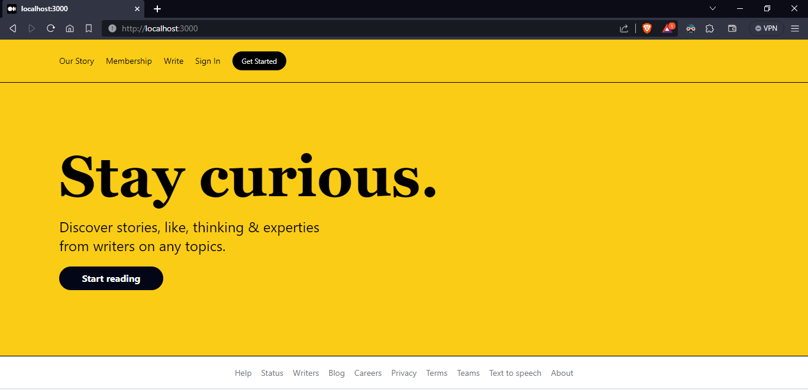
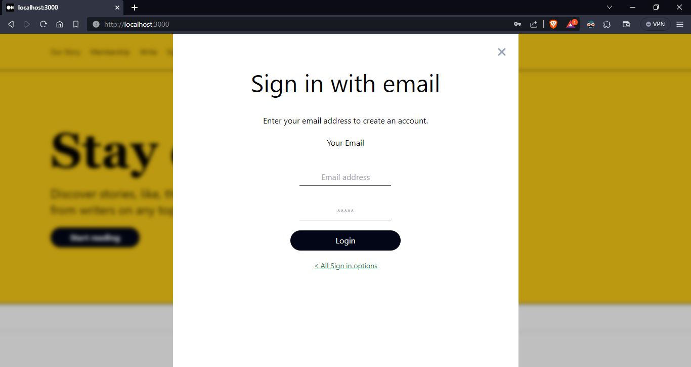
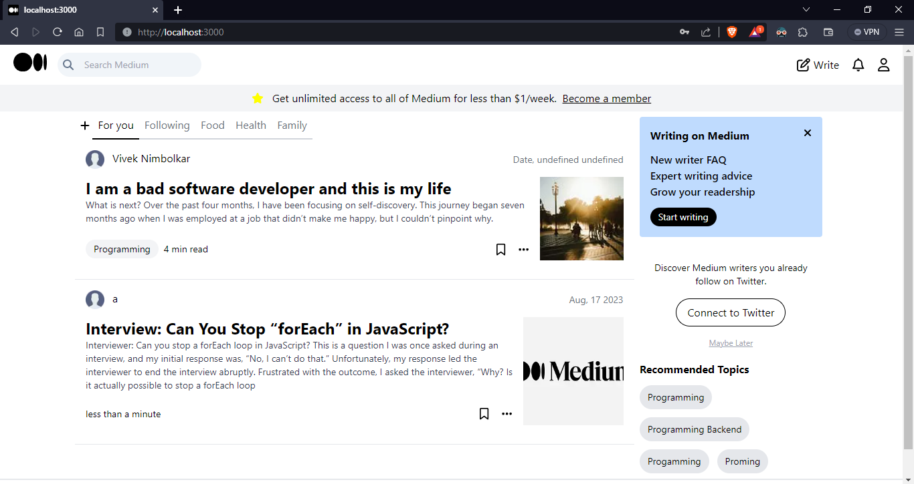
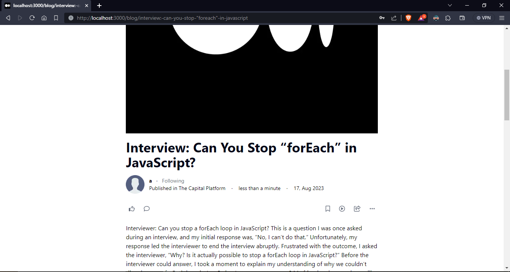
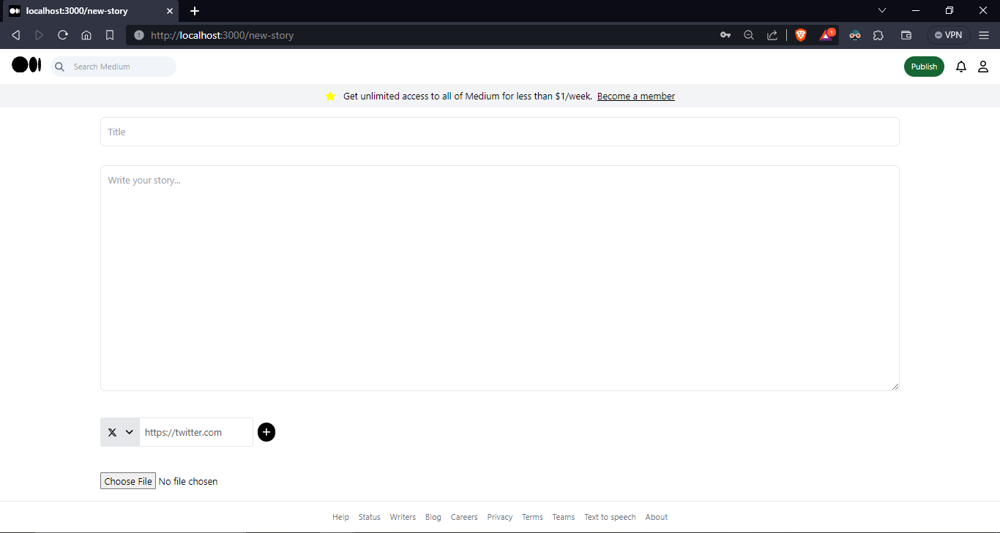
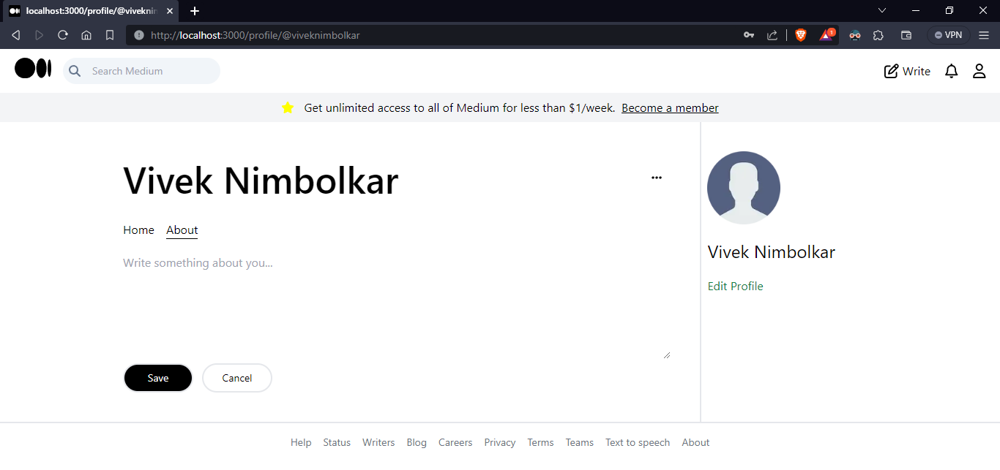
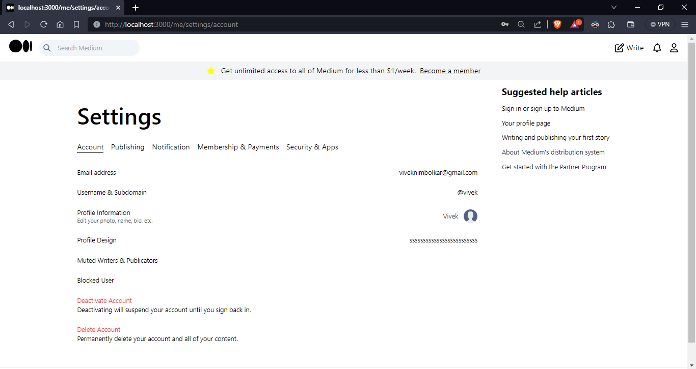
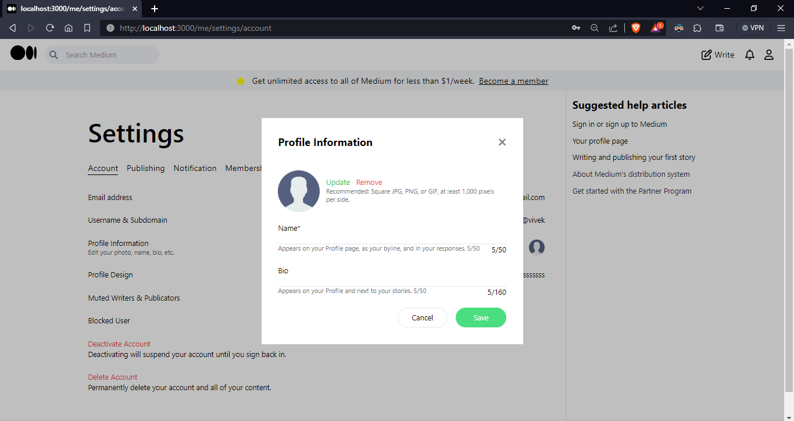

# Medium Clone

A basic clone of medium application.

## Tech Stack Used
- Next.js
- Mongodb

## Run app
- Create .env.local file and add these variables `MONGODB_URI`, `JWT_SECRET`,  `BASE_URL`

